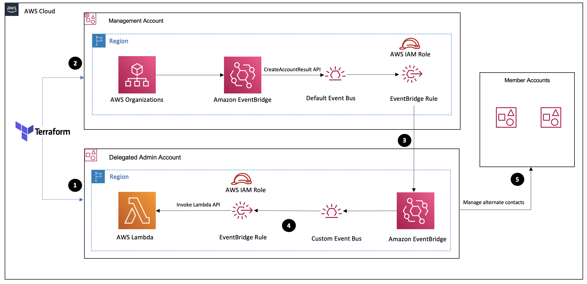

# [Blog Post - Manage AWS account alternate contacts with Terraform](https://amazon.com/blogs/mt/manage-aws-account-alternate-contacts-with-terraform/)


## Description

This Terraform module enables the programmatic implementation and management of AWS account alternate contacts on member accounts in [AWS Organizations](https://aws.amazon.com/organizations/). For additional implementation guidance, refer to the blog post on how to [manage AWS account alternate contacts with Terraform](https://amazon.com/blogs/mt/manage-aws-account-alternate-contacts-with-terraform/).


## Features
* Programmatically manage billing, operations, or security contact across all of your accounts.
* Easily set the alternate contacts on new accounts that you create or add to AWS Organizations.


## Prerequisites

The following prerequisites are required to deploy the solution:

1. [Download](https://www.terraform.io/downloads.html) and set up Terraform. You can see these [instructions](https://learn.hashicorp.com/collections/terraform/aws-get-started) to get started with Terraform on AWS.

2. Make sure that your Terraform environment is able to assume an administrative role to implement the resources described in this blog across your management and delegated administrator accounts.

3. Opt in to use the [AWS Account Management](https://docs.aws.amazon.com/accounts/latest/reference/accounts-welcome.html) service for your organization so you can centrally manage alternate contacts. You can do this by using the [AWS Command Line Interface](https://aws.amazon.com/cli/) or [AWS CloudShell](https://aws.amazon.com/cloudshell/) from the management account:

   `aws organizations enable-aws-service-access --service-principal account.amazonaws.com`

4. Register a delegated administrator so users don’t need access to the management account to manage alternate contacts. Make sure that you replace `<YOUR-CHOSEN-ACCOUNT-ID>` with the account id of your delegated administrator:

   `aws organizations register-delegated-administrator --account-id <YOUR-CHOSEN-ACCOUNT-ID> --service-principal account.amazonaws.com`

You only need to perform steps 3 and 4 once all through the lifecycle of your AWS account. You can use the AWS CLI or a [Terraform resource](https://registry.terraform.io/providers/hashicorp/aws/latest/docs/resources/organizations_organization).


## Solution architecture and design
The following diagram illustrates the account alternate contact automation outlined in this repository:

## 

The following steps describe the workflow of the solution discussed in this blog:

Enable the [AWS Account Management](https://docs.aws.amazon.com/accounts/latest/reference/accounts-welcome.html) service for your organization and register a delegated administrator in the management account (see the prerequisites section).

1. In the designated administrator account, the Terraform module implements a custom Amazon EventBridge event bus, EventBridge Rule, IAM roles, and AWS Lambda function to programmatically configure your alternate contact.

2. In the Management account, the Terraform module implements an IAM role and EventBridge rule attached to the Default event bus. The rule consists of a cross-account event trigger that invokes the Lambda function in your delegated account when a new account is added to your AWS Organizations.

3. When a new account is added to AWS Organizations, the default event bus in the Management account receives the [CreateAccountResult](https://docs.aws.amazon.com/organizations/latest/APIReference/API_CreateAccount.html) API event in [AWS CloudTrail](https://aws.amazon.com/cloudtrail/) to acknowledge the account creation event. Then, it routes the event to a local EventBridge rule and forwards the event to a custom event bus in the delegated administrator account using a cross-account event bus.

4. The custom event bus triggers routes the event to an EventBridge rule that triggers  the Lambda function in the delegated administrator account.

5. The function obtains the list of member accounts, and configures the alternate contact in each account.

## Implementation steps

The implementation process of the solution is follows:

1. Configure the [variables.tf](./variables.tf) file with your variable parameters. You can use a `terraform.tfvars` to parse your variables.

2. Run `terraform init` to initialize the module.

3. Deploy the root module in the same region across your management and designated administrator accounts using `terraform apply`.


## Resources

| Name                                            | Type         |
| ---------                                       |----          |
| aws_organizations_organization                  | Resource     |
| aws_organizations_delegated_administrator       | Resource     |
| aws_iam_role                                    | Resource     |
| aws_iam_policy                                  | Resource     |
| aws_lambda_function                             | Resource     |
| aws_lambda_permission                           | Resource     |
| aws_cloudwatch_log_group                        | Resource     |
| aws_cloudwatch_event_bus                        | Resource     |
| aws_cloudwatch_event_bus_policy                 | Resource     |
| aws_cloudwatch_event_rule                       | Resource     |
| aws_cloudwatch_event_target                     | Resource     |


## Usage

To implement multiple contacts using this module, modify the `main.tf` file in the root directory.
_Example usage below._

```hcl
module "delegated_admin_account" {
  source = "./modules/delegated_account"
  providers = {
    aws = aws.delegated_account
  }

  management_account_id = 123456789012
  security_alternate_contact = CONTACT_TYPE=SECURITY; EMAIL_ADDRESS=john@example.com; CONTACT_NAME=John Bob; PHONE_NUMBER=1234567890; CONTACT_TITLE=Risk Manager
  billing_alternate_contact = CONTACT_TYPE=BILLING; EMAIL_ADDRESS=alice@example.com; CONTACT_NAME=Alice Doe; PHONE_NUMBER=1234567890; CONTACT_TITLE=Finance Manager
  operations_alternate_contact = CONTACT_TYPE=OPERATIONS; EMAIL_ADDRESS=bob@example.com; CONTACT_NAME=Bob Smith; PHONE_NUMBER=1234567890; CONTACT_TITLE=Operations Manager
  
  invoke_lambda        = var.invoke_lambda
  tags                 = {
     Project     = "AWS-Alternate-Contact"
     Environment = "Dev"
  }
}


module "management_account" {
  source = "./modules/management_account"
  providers = {
    aws = aws.mgmt_account
  }

  delegated_account_event_bus = module.delegated_admin_account.delegated_account_bus
  tags = {
    Project     = "AWS-Alternate-Contact"
    Environment = "Dev"
  }
}
```


## Provider and version Requirements

All provider and version requirements can be found in the child modules and the [providers.tf](./providers.tf) file.


## Input Variables

All variable details can be found in the [variables.tf](./variables.tf) file.


| Variable Name               | Description                                                                      | Type         |  Default                      | Required |
| -------------               | -----------                                                                      | --------     | -----                         |--------  |
| `region`                    | The home Region of the AWS Organizations management account                      | `string`     |                               | Yes      |
| `management_account_id`     | The account ID of the AWS Organizations Management account.                      | `string`     |                               | Yes      |
| `alternate_contacts`    | The alternate contact details. Valid values for contact types are: SECURITY, BILLING, OPERATIONS.   | `list(map(string))`| {}                            | Yes      |
| `invoke_lambda`             | Controls if Lambda function should be invoked                                    | `bool`       | true                          | No       |
| `tags`                      | A map of tags to assign to the resource                                          | `map(string)`|                               | No       |


## Outputs

All output details can be found in [outputs.tf](./outputs.tf) file.

| Output Name                         | Description                                                                                   |
| -------------                       | -----------                                                                                   |
| `delegated_account_event_bus`       | The ARN of the custom event bus in the delegated account                                      |
| `delegated_account_event_rule`      | The Amazon Resource Name (ARN) of the EventBridge rule in the delegated account               |
| `delegated_account_lambda_function` | The Amazon Resource Name (ARN) identifying the Lambda Function in the delegated account       |
| `management_account_event_bus_role` | The Amazon Resource Name (ARN) specifying the event bus IAM role in the management account    |

## Changelog

A complete Changelog history can be found in [CHANGELOG.md](CHANGELOG.md).
